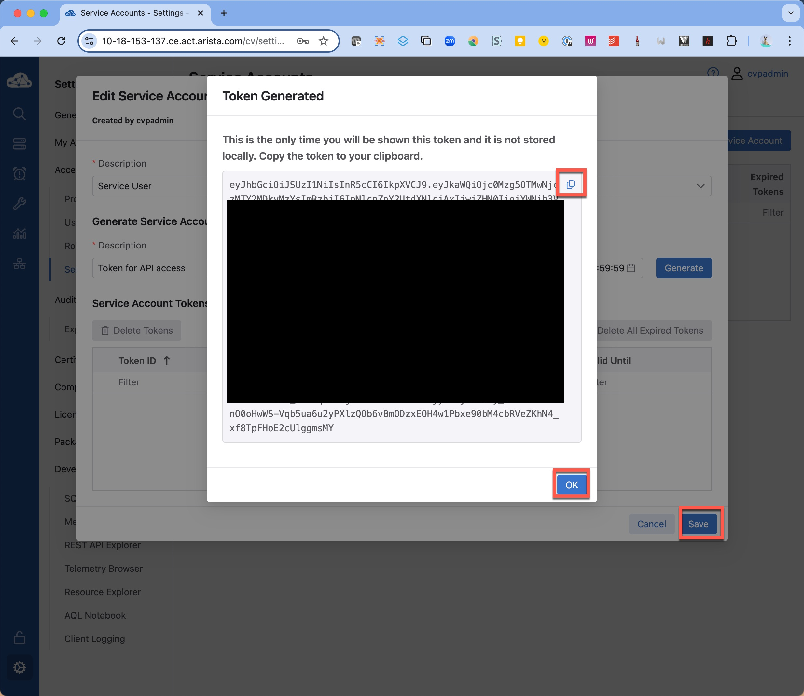

# Seriennummern der Optikmodule in CSV-Datei schreiben

Mit der Hilfe des Scripts `transceiver.py` können aus CVP die Seriennummern der Optikmodule ausgelesen
werden, die in den in CVP verwalteten Switches verbaut sind.

Das Script verwendet hierzu die Google Remote Procedure Control (gRPC) Schnittstelle um die sogenannte
Aeris-Datenbank von CVP abzufragen.

## Authentifizierung

Damit das Script auf CVP zugreifen kann, muss zuvor ein Service-Benutzer mit einem API-Token angelegt
werden.

Geht hierzu bitte wie folgt vor:

1. Loggt euch in CVP ein.
2. Klickt auf das Zahnrad-Symbol für die Einstellungen und dann auf „New Service Account“.
   
3. Gebt den Namen und die Beschreibung ein, wählt „Network Operator“ als Rolle und klickt auf „Create“.
   
4. Klickt auf das neu angelegte Service-Konto.
   
5. Gebt eine Beschreibung für das Token ein, wählt ein Ablaufdatum aus und klickt auf „Generate“.
   
6. Kopiert das Token in die Zwischenablage und speichert es in einer Textdatei im Ordner des Scripts ab.
   Danach schließt das Fenster mit „OK“ und „Save“.
   

## Zertifikat

Falls CVP ein selbst-signiertes Zertifikat verwendet oder ein Zertifikat von einer internen
Zertifizierungsstelle, muss das Zertifikat von CVP heruntergeladen und im Ordner des Scripts
abgelegt werden.

## Verwendung

Installiere zuerst die Abhängigkeiten:

 ```bash
 pip install -r requirements.txt
 ```

Ruft das Script wie folgt auf:

```bash
python transceiver.py --servername <CVP> --tokenfile <TOKENFILE> --csvfile <CSV-DATEI>
```

Wird kein Dateiname für die CSV-Datei angegeben, so wird in die Datei `transceiver.csv` geschrieben.
Falls das Zertifikat von CVP nicht vertrauenswürdig ist, kann das Zertifikat mit der Option
`--cafile` angegeben werden.

```bash
python transceiver.py --servername <CVP> --tokenfile <TOKENFILE> --csvfile <CSV-DATEI> --cafile <CA-DATEI>
```
